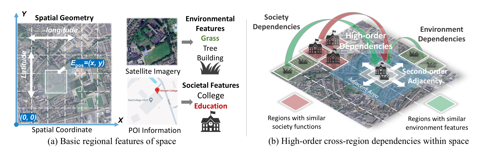

<p align="center">
  <a href="intro.pdf">
    
  </a>
  <br/>
</p>

## GeoHG: Space-aware Socioeconomic Indicator Inference with Heterogeneous Graphs 🌏📊
<span id='Top'/>

PyTorch implementation for the paper “Space-aware Socioeconomic Indicator Inference with Heterogeneous Graphs”.

If you find this repo helpful, please consider citing our work.

```
@inproceedings{zou2024space,
  title={Space-aware Socioeconomic Indicator Inference with Heterogeneous Graphs},
  author={Zou, Xingchen and Huang, Jiani and Hao, Xixuan and Yang, Yuhao and Wen, Haomin and Yan, Yibo and Huang, Chao and Chen, Chao and Liang, Yuxuan},
  booktitle={The 33rd ACM International Conference on Advances in Geographic Information Systems}
  year={2025}
}
```

### Table of Contents
- <a href='#Code Structure'>1. Code Structure</a>
- <a href='#Environment Preparation'>2. Environment</a>
- <a href='#Hyper-graph Data'>3. Build Hyper-graph Data</a>
- <a href='#GeoHG Training and Evaluation'>4. Train & Evaluate GeoHG</a>
- <a href='#GeoHG-SSL Training and Evaluation'>5. Self-Supervised Pretraining (GeoHG-SSL)</a>

---

<span id='Code Structure'/>

### 1) Code Structure 🗂️ <a href='#Top'>[Back to Top]</a>

```
.
├── README.md
├── requirements.txt
├── train_model.py
├── self_supervised.py
├── model.py
├── data_utils.py
├── data
│   ├── logs                      # training logs and plots
│   ├── models                    # saved models
│   ├── Hyper_Graph               # hyper-graph inputs per city
│   │   ├── GZ | BJ | SH | SZ
│   │   │   ├── ANA.txt          # Area–Near–Area edges
│   │   │   ├── ELA.txt          # Entity–Locate–Area hyperlinks
│   │   │   ├── PLA.txt          # POI–Locate–Area hyperlinks
│   │   │   ├── pos_encode.txt   # position encodings per area
│   │   │   ├── POI_feature.csv  # POI feature ratios per area
│   │   │   └── TIF_feature.csv  # environmental feature ratios per area
│   ├── downstream_tasks          # ground truth y for tasks per city
```

<span id='Environment Preparation'/>

### 2) Environment ⚙️ <a href='#Top'>[Back to Top]</a>

```bash
conda create -n geohg python=3.10 -y
conda activate geohg

# Clone
git clone <your-repo-url>
cd GeoHG

# Install dependencies
pip install -r requirements.txt
```

<span id='Hyper-graph Data'/>

### 3) Build Hyper-graph Data 🧩 <a href='#Top'>[Back to Top]</a>

> 🤖 We’re exploring an automated agent to construct these data files for easier use and faster interpolation. Interested in building, testing, or using it? Contact: xczou[at]connect.hku.hk

GeoHG consumes a heterogeneous graph per city with three relations and several feature files:

- ANA.txt (Area–Near–Area, undirected after preprocessing)
- ELA.txt (Entity–Locate–Area, weighted)
- PLA.txt (POI–Locate–Area, weighted)
- pos_encode.txt (per-area 2D coordinates)
- TIF_feature.csv (environmental ratios per area)
- POI_feature.csv (POI ratios per area)

Below are the exact expected formats with real examples from `data/Hyper_Graph/GZ`:

- ANA.txt ➜ one edge per line: `Area/<src> ANA Area/<dst>`
  - Example:
    - `Area/0 ANA Area/1`
    - `Area/1 ANA Area/70`

- ELA.txt ➜ one weighted hyperlink per line: `Entity/<eid> ELA Area/<aid> Proportion/<p>`
  - Example:
    - `Entity/8 ELA Area/1606 Proportion/0.9693`

- PLA.txt ➜ one weighted hyperlink per line: `POI/<pid> PLA Area/<aid> Proportion/<p>`
  - Example:
    - `POI/4 PLA Area/6204 Proportion/0.4961560878791815`

- pos_encode.txt ➜ CSV with `area_id,x,y` (no header)
  - Example:
    - `1606,0.12,0.34`

- TIF_feature.csv ➜ columns: `File,Coordinates,Area,<Value_1_Ratio...Value_k_Ratio>`
  - We use the `Area` column to align with graph node ids and slice ratio columns as features.

- POI_feature.csv ➜ columns: `TIF,POI_0,...,POI_13,Count`

Tips 🛠️:
- Ensure that all area ids used in ELA/PLA/TIF/POI files exist in ANA areas.
- You can filter weak hyperlinks via CLI thresholds (see `--entity_thresh`, `--poi_thresh`).
- The preprocessing will convert the graph to undirected internally.

<span id='GeoHG Training and Evaluation'/>

### 4) Train & Evaluate GeoHG 🚀 <a href='#Top'>[Back to Top]</a>

Train on a city/task with default settings; artifacts go to `data/logs` and `data/models`.

```bash
python train_model.py --city GZ --task Carbon --masked_ratio 0.7
```

Key args:
- `--city` in {GZ, SZ, BJ, SH}
- `--task` in {Carbon, Light, Population, GDP, PM25}
- `--pos_embedding` 1/0 to enable position features
- `--hypernode` in {all, entity, poi, mono}

<span id='GeoHG-SSL Training and Evaluation'/>

### 5) Self-Supervised Pretraining (GeoHG-SSL) 🧠 <a href='#Top'>[Back to Top]</a>

Contrastive pretraining of the GNN encoder:

```bash
python self_supervised.py --city GZ --neigh_num 5
```

This saves a model under `data/models/ssl_*.pth`. To finetune on a downstream task:

```bash
python train_model.py --city GZ --task Carbon --load_gnn <ssl_path> --gnn_training False
```

—

Happy graphing! 🧭 If anything is unclear or you’d like ready-made data builders, please open an issue or PR. 💬